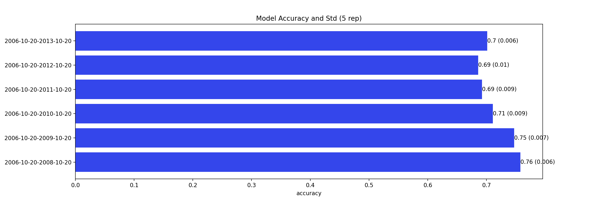
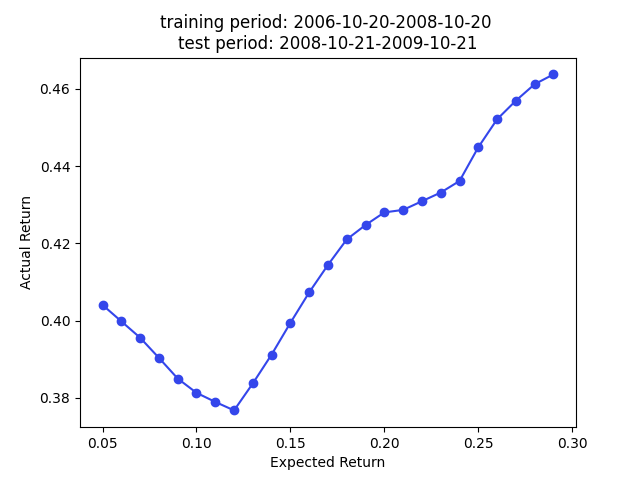
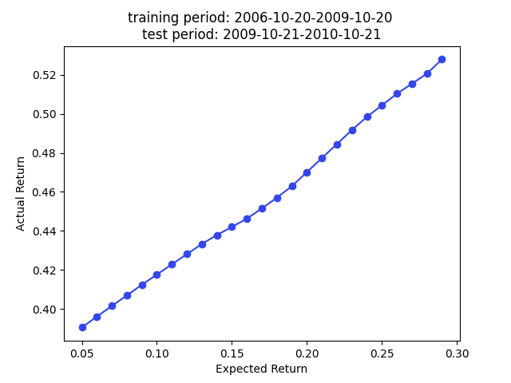
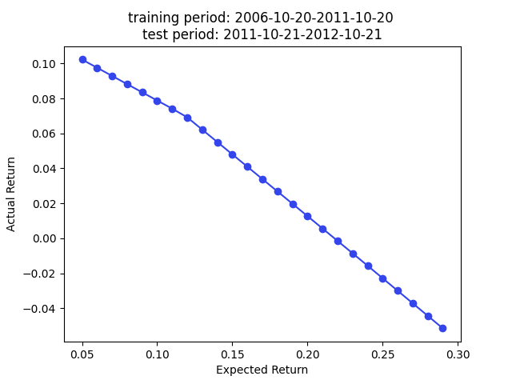
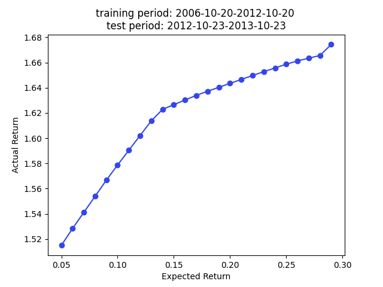
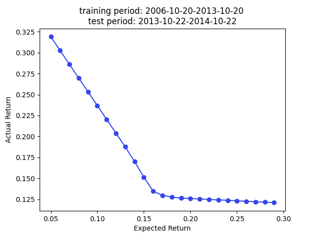

## Introduction
This repo is implemented according to the methodology described in paper [_Stock Embeddings Acquired from News Articles and Price History, and an Application to Portfolio Optimization_](https://aclanthology.org/2020.acl-main.307/).

The goal is to construct embeddings for a set of selected US stocks, which represents a given ticker by a numeric vector. The concept of embedding is popular in Natural Language Processing (NLP) and is the fundamental building block for any Large.  Language Model (LLM).

Once a set of vector representations is learnt for selected stocks, we can use the learnt embeddings for any downstream task. Follow the paper, a quartratic programming portfolio optimization is implemented using the stock covariance matrix based on the embeddings.

## Data
There are two types of data used in this repo.
- News data from Reuters and Bloomberg from 2006 to 2013. The data from original [repo](https://github.com/philipperemy/financial-news-dataset) is no longer available, but you can email the author for the dataset for your own research.
    > However, if you have a request about it, send it to me at premy.enseirb@gmail.com and put the words "bloomberg dataset" in your email body.

    Note that the Reuters data shared above only has title, so I only used the Bloomberg data.
- For complete Reuters data, you can find [here](https://github.com/HanssonMagnus/financial-news-dataset).
- Stock price data is fetched based on the popular Python package `yfinance`.

## Methodology
### News Preprocessing
The paper used a dual-vector representation of news article texts, namely, the TFIDF-weighted word embedding and BERT encoder for news title. In this repo, I used `Fasttext` to train word embeddings based on entire news article collections f or TFIDF-weighted embedding and used `sentence_transformers` package instead to encode the article title.

The target variable the daily stock price movement. The daily log return > 0.0068 is labeled as 1 and daily log return < -0.0059 is labeled as 0.

### Model
The stock price movement prediction is considered a very difficult problem, if we only include news article strictly before the price date. However, if we include the news for the same price date, this problem is more reasonable as the goal is to learn the embedding vector rather than making a good stock price movement preditive model. Therefore, the news of same price date and 4 days prior (total 5 days of news) are included to 'predict' the stock movement.

Motivated by the attention mechanism, for day $t$, the input data is a pair of 'key' and 'value' news embeddings $(n_i^K, n_i^V)$. The paper denoted the collection of the TFIDF-weighted news embeddings by $N_t^K=\lbrace n_i^K\rbrace_t$ and sentence embeddings by $N_t^V=\lbrace n_i^V\rbrace_t$. The model first calculate the attention score of stock $i$ and news $j$ as $\text{score}_{i,j} = n_i^K \cdot s_j$, where $s_j$ is the stock embedding for stock $j$. The attention to the sentence embedding is the softmax value of the scores $\alpha_i^j$.

Finally, the market vector for stock $j$ on day $t$ is
$$m_t^j = \sum_{n_i^V\in N_t^V} \alpha_i^j n_i^V$$

To predict the stock movement, we need the most recent 5 days market vectror collection $M^j_{[t-4, t]}=[m^j_{t-4}, m^j_{t-3}, \dots, m^j_{t}]$. The model used a Bi-GRU layer and a MLP layer to estimate the positive movement probability $\hat y_t^j$, i.e., $h_t^O = \text{GRU}(M^j_{[t-4, t]})$, and $\hat y_t^j = \sigma(\text{MLP}(h^O-t))$.

The optional temporal re-weighting method is also implemented.

## Backtest
I follow the backtest method proposed in the paper, i.e., randomly partition the data into training and validation set. However, instead having training, validation, and test set, I used cross-validation during model training.

Following plot summarizes the model out-of-sample prediction accuracy. The y label is the training data period, and the out-of-sample period is 1 year right after the training period. The results are highly comparable to the results in the paper.

Note that this is a predition problem involving time series. Therefore, the random partition is NOT the proper approach (70\% prediction accuracy is too good to be true for stock prediction) if our main focus is the prediction accuracy. A partition by time is more suitable to avoid look ahead bias if we want to test the true prediction accuracy. However, we care about stock embedding and the only use the out-of-sample accuracy to ensure we have a reasonably good model performance so we know the embeddings are trustworthy.

## Portfolio Optimization
The paper used the embedding for portfolio construction. The idea is to use cosine similarity as an approxy of covariance, so we can plug in the cosine similarity matrix as a covariance matrix (technically a correlation matrix) for portfolio construction.

More specifically, we want to minimize $\text{risk}=w^T\Sigma w$ over portfolio weights vector $w$ subject to $w^Tr=E$, where $r$ is a vector of historical stock return, and $E$ is the expected return set by the user. To make a proper portfolio, we require the stock weights to be between 0 to 1 and sum to 1. I broke the out-of-sample portfolio returns by training periods.

 

 

 

 

 

 

We have superior returns against s&p 500 across all expected returns in 2009, 2010, and 2013. The returns in 2014 are very good for smaller $E$. The return is worse than the benchmark in 2011 and 2012.

Note that we use the cosine similarity as $\Sigma$ in the above optimization, a more appropriate approach should estimate stock volatility individually and reconstruct the covariance matrix based on the correlation matrix and stock volatilities.

## Run Pipeline